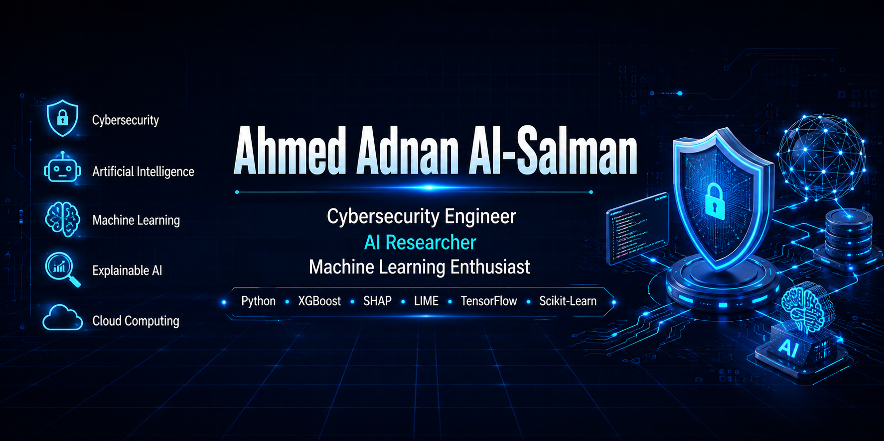

  

  

# Hi there, I'm Ahmed Adnan Al-Salman 👋

Cybersecurity & Networking Engineer | AI & Explainable AI Researcher

I am a Cybersecurity & Networking Engineering graduate with a strong interest in Artificial Intelligence, Explainable AI (XAI), Machine Learning, and Network Security.

My goal is to develop intelligent and trustworthy cybersecurity solutions while continuously expanding my research and technical expertise.
## 📈 GitHub Analytics

  

  

  

  

---

## 🎓 Education

🎓 **Bachelor of Science (BSc Hons)**  
**Cyber Security & Networking Engineering**  
University of Central Lancashire (UCLan), United Kingdom

🎓 **Pearson BTEC Higher National Diploma (HND)**  
**Computing (Intelligent Systems)**  
Awarded by Pearson BTEC, United Kingdom  
Studied at ABC Horizon Campus, Istanbul, Türkiye

---

## 🔬 Research Interests

- Explainable Artificial Intelligence (XAI)
- Machine Learning
- Network Intrusion Detection Systems
- Cybersecurity
- Cloud Computing
- Network Security

---

## 🚀 Featured Projects

### ⭐ TrustXAI
Explainable AI Framework for Multiclass Network Intrusion Detection using Random Forest, XGBoost, SHAP and LIME.

### 🩺 Disease Prediction System
Machine Learning-based application for disease prediction using Python and Scikit-learn.

### 👥 HR Management System
Desktop HR Management System built with Python, Tkinter, ttkbootstrap, SQLite, and Pandas. Features employee management, KPI tracking, salary management, search, and data export.

---

## 🏆 Certifications

- Fortinet Certified Fundamentals (FCF)
- Cisco Networking Academy
- IBM SkillsBuild
- Google Cloud Skills Boost
- One Million Prompters
- HarvardX CS50 Cybersecurity

---

## 💻 Technical Skills

- Python
- Machine Learning
- Explainable AI (XAI)
- Random Forest
- XGBoost
- SHAP
- LIME
- Network Security
- Intrusion Detection
- Linux
- Git & GitHub

---

## 📫 Connect with me

- LinkedIn:
  https://www.linkedin.com/in/ahmedadnan93

- Location:
  Basra, Iraq
